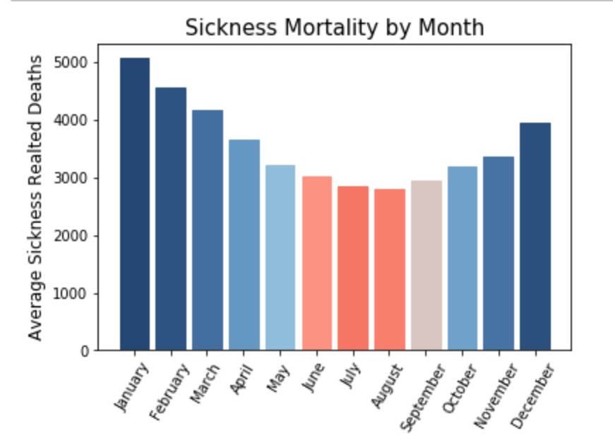
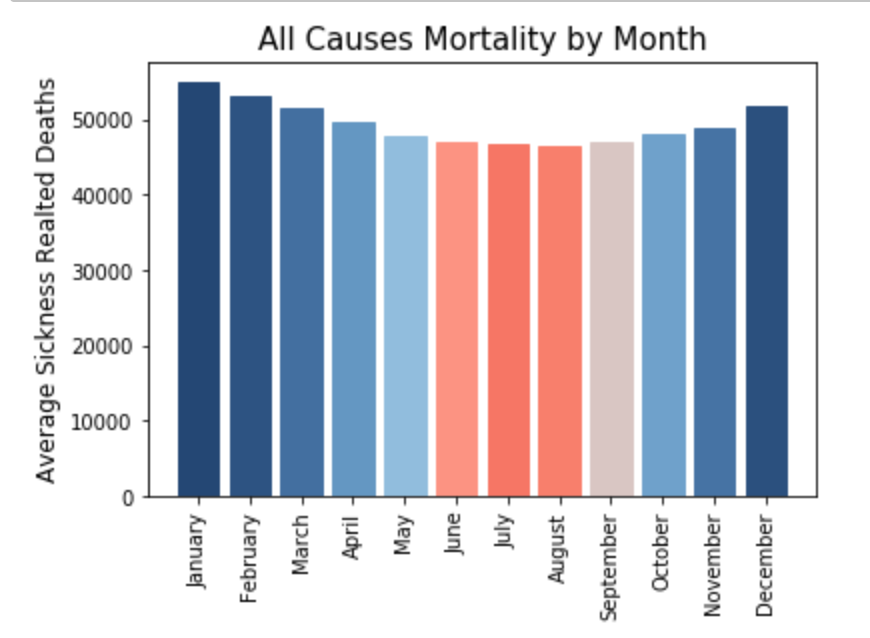
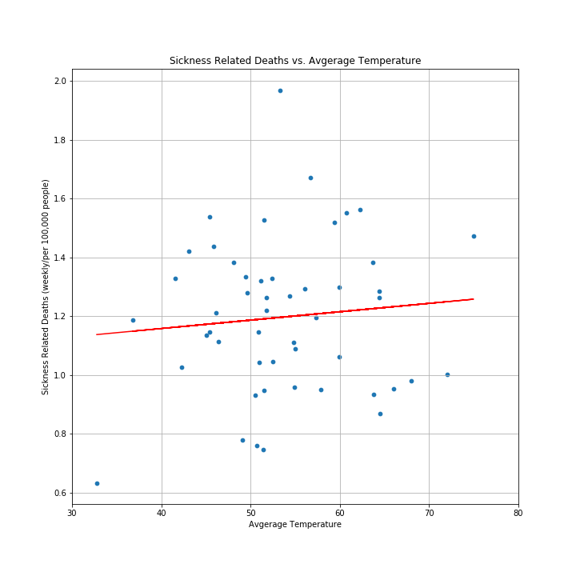
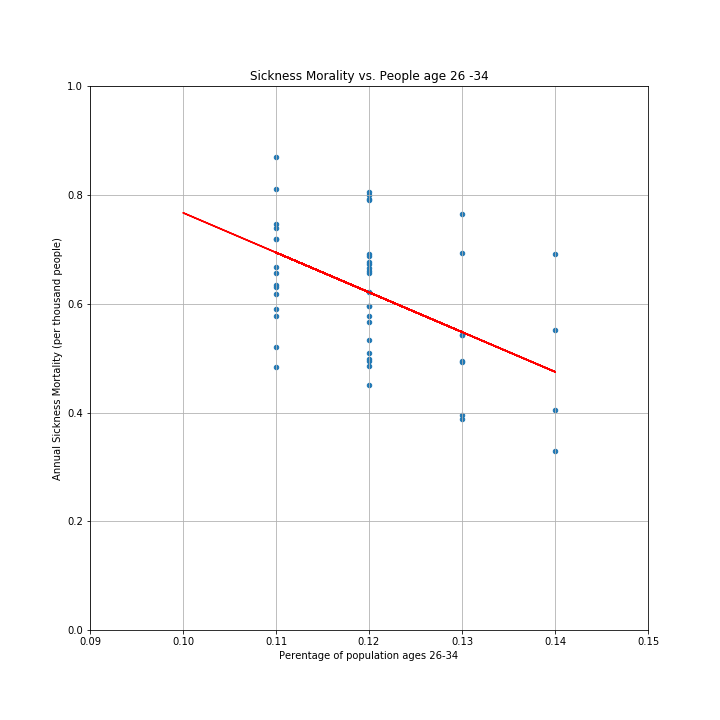
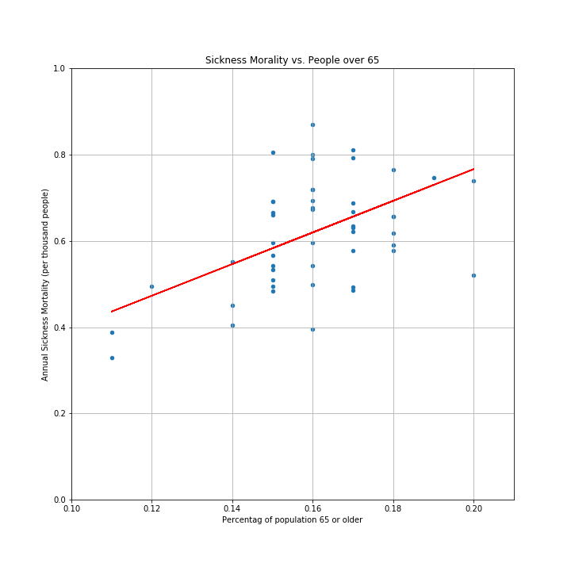
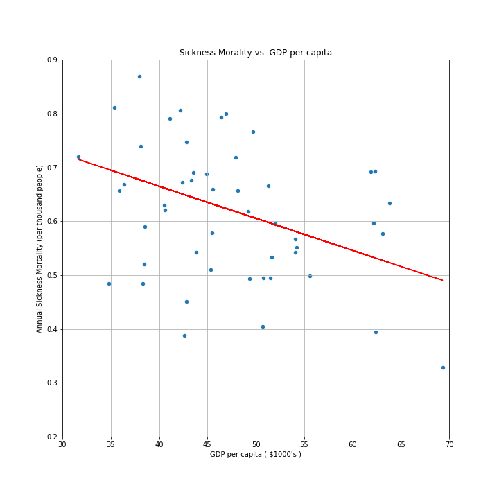
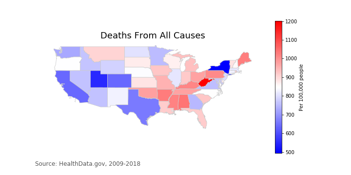

# Flu Fighters 

A collection of visualizations built using python to show how deaths from influenza and pneumonia are related to various other factors including temperatures, population age, and wealth. All data is compared on the state level.

Created for first group project in classes the UT Data analysis and visualization boot camp.

### Technologies Used
* Jupyter Notebooks
* Matplotlib
* Pandas
* NumPy
* Geopandas

### Team Members

- [ljjbill](https://github.com/ljjbill)
- [Daniel-Lomeland](https://github.com/Daniel-Lomeland)
- [NichelleR](https://github.com/NichelleR)
- [tejasbabu](https://github.com/tejasbabu)

## Seasonality and Temperatures

## Age Related Effects

## Wealth Effects 

## Mapping it out

